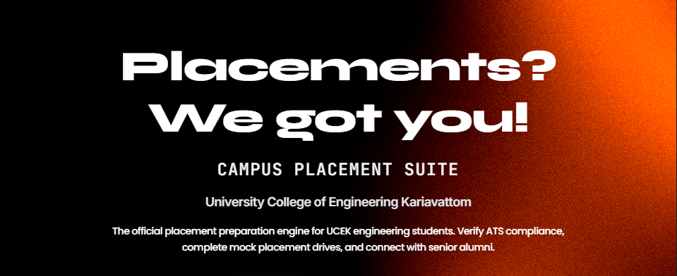

# 🎓 Impulse

### Campus Placement Suite — University College of Engineering Kariavattom

**The official placement preparation engine for UCEK engineering students.**  
Designed and developed by the Unstop Igniters Club.

---

## 🌟 Overview

**Impulse** is an all-in-one placement and career readiness portal tailored specifically for engineering students at **University College of Engineering Kariavattom (UCEK)**. The platform bridges the gap between academic preparation and industry expectations by offering interactive self-assessment tools, resume optimization, mock recruitment tests, structured domain roadmaps, and direct connection with alumni mentors.

---

## ✨ Key Features

### 📄 AI Resume Suite
- **ATS Score Analysis**: Instant evaluation of resume compatibility against modern Applicant Tracking Systems.
- **Section-by-Section Feedback**: Detailed critique on layout, summary, work experience, projects, formatting, and technical skills.
- **Actionable AI Suggestions**: Intelligent bullet-point rephrasing and impact word suggestions to maximize callback rates.

### 🎙️ HR Interview Simulator
- **Interactive Practice Sessions**: Practice behavioral and HR interview rounds with dynamic, context-aware question scenarios.
- **Real-Time Evaluation**: Instant feedback on communication quality, answer structure, confidence, and key talking points.
- **Performance Analytics**: Track interview performance metrics and historical progress over time.

### 📝 Mock Placement Tests
- **Simulated Recruitment Drives**: Timed aptitude, logical reasoning, verbal ability, and domain-specific technical tests.
- **Instant Scoring & Analytics**: Immediate detailed score breakdown, answer keys, and weak-area identification.
- **Custom Assessment Categories**: Specialized test tracks covering CSE, ECE, IT, and general campus recruitment formats.

### 🗺️ Domain Learning Roadmaps
- **Structured Career Paths**: Step-by-step learning roadmaps for Core Engineering, Software Development, Embedded Systems, and more.
- **Interactive Progress Tracking**: Mark completed topics, view upcoming skill milestones, and track placement readiness.
- **Curated Learning Resources**: Handpicked tutorials, practice problems, and study guides for each module.

### 🤝 Alumni Mentorship Network
- **Verified Mentor Profiles**: Connect directly with UCEK alumni working in top engineering and technology firms.
- **1-on-1 Guidance**: Schedule mock interviews, resume reviews, and career counseling sessions.
- **Industry Insights**: Gain firsthand knowledge on company recruitment patterns, work culture, and interview expectations.

### 📊 Placement Admin & Analytics Panel
- **Student Readiness Tracking**: Comprehensive analytics for Placement Officers (TPO) to monitor batch progress and readiness.
- **Drive Management**: Organize, schedule, and track student registration for upcoming campus recruitment drives.
- **Custom Test Creation**: Faculty and admins can create, publish, and manage custom mock assessment papers.

---

## 👥 Targeted User Roles

| Role | Core Capabilities |
|------|-------------------|
| **Students / Mentees** | Take mock tests, optimize resumes, practice HR interviews, track roadmaps, and request alumni mentorship. |
| **Alumni Mentors** | Provide career counseling, review student resumes, conduct 1-on-1 mock interviews, and share industry guidance. |
| **Placement Admins (TPO)** | Monitor student performance analytics, manage campus recruitment drives, and publish custom assessments. |

---

## 🎯 Product Principles

1. **Immediate & Actionable Feedback**: Every module provides instant scores, detailed analysis, and clear steps for improvement.
2. **End-to-End Placement Journey**: Seamlessly guides students from foundational skill building to final interview readiness.
3. **Realistic Campus Drive Simulation**: Replicates actual corporate recruitment tests, timing constraints, and interview formats.
4. **Institutional Synergy**: Leverages UCEK's alumni network and placement cell workflows for a tailored experience.

---

## 👥 Team & Contributors

Developed with dedication by the **Unstop Igniters Club, UCEK**:

<table>
  <tr>
    <td align="center"><b>Amarnath Sujith</b> Full-Stack Developer</td>
    <td align="center"><b>Karthik S</b> Backend Developer - System Architect</td>
    <td align="center"><b>Theertha S Nair</b> Full-Stack Developer</td>
    <td align="center"><b>Nimish M Biju</b> Frontend Developer</td>
  </tr>
</table>

---

## 📄 License

This project is developed for **University College of Engineering Kariavattom (UCEK)** by the **Unstop Igniters Club**.

This repository is protected under a strict proprietary **All Rights Reserved** license. Unauthorized copying, modification, redistribution, public hosting, or commercial use is strictly prohibited. See the [LICENSE](LICENSE) file for full details.

---

  Built with ❤️ by the Unstop Igniters Club, UCEK

