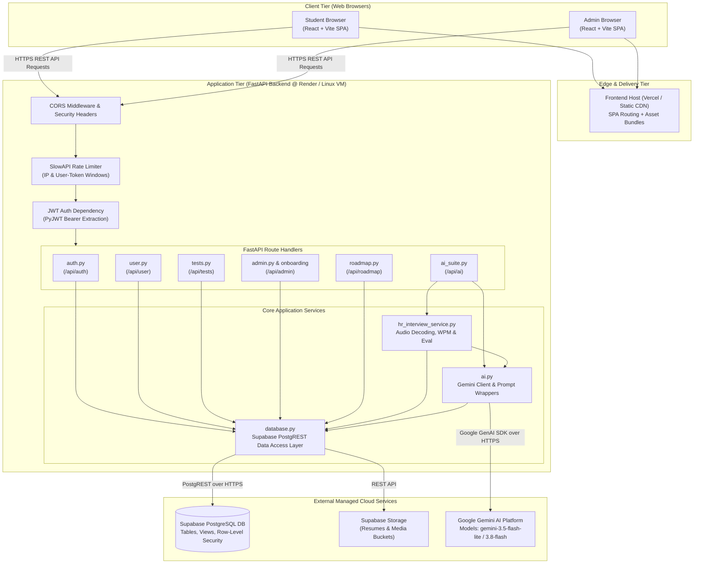
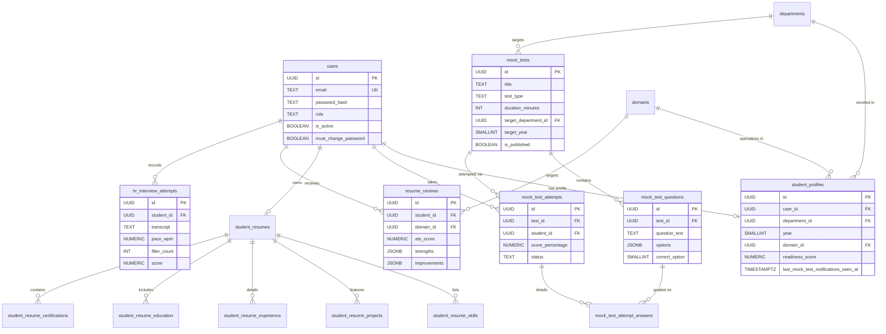
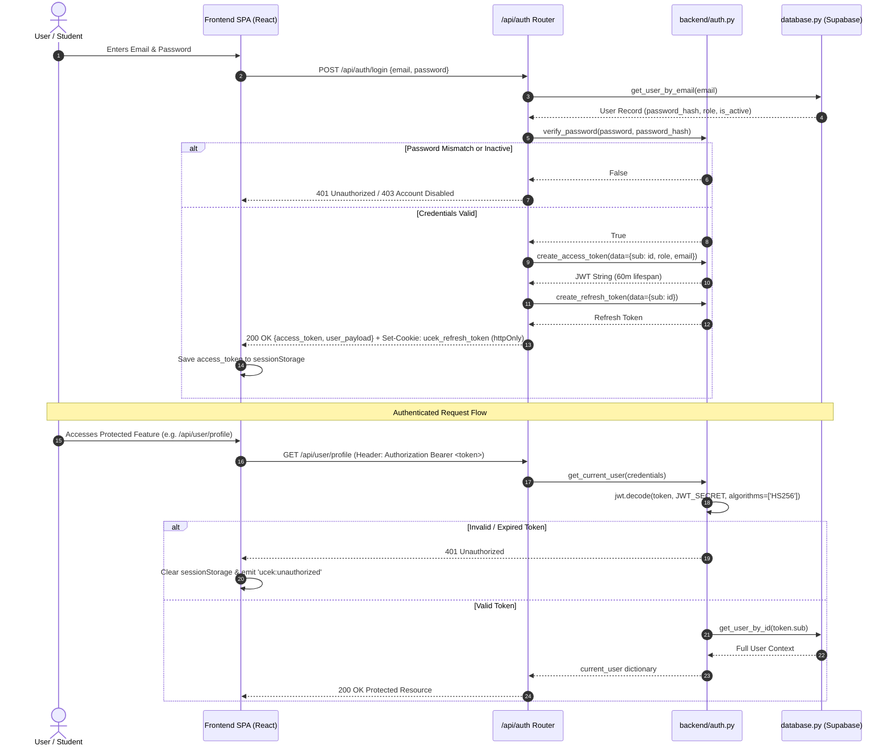
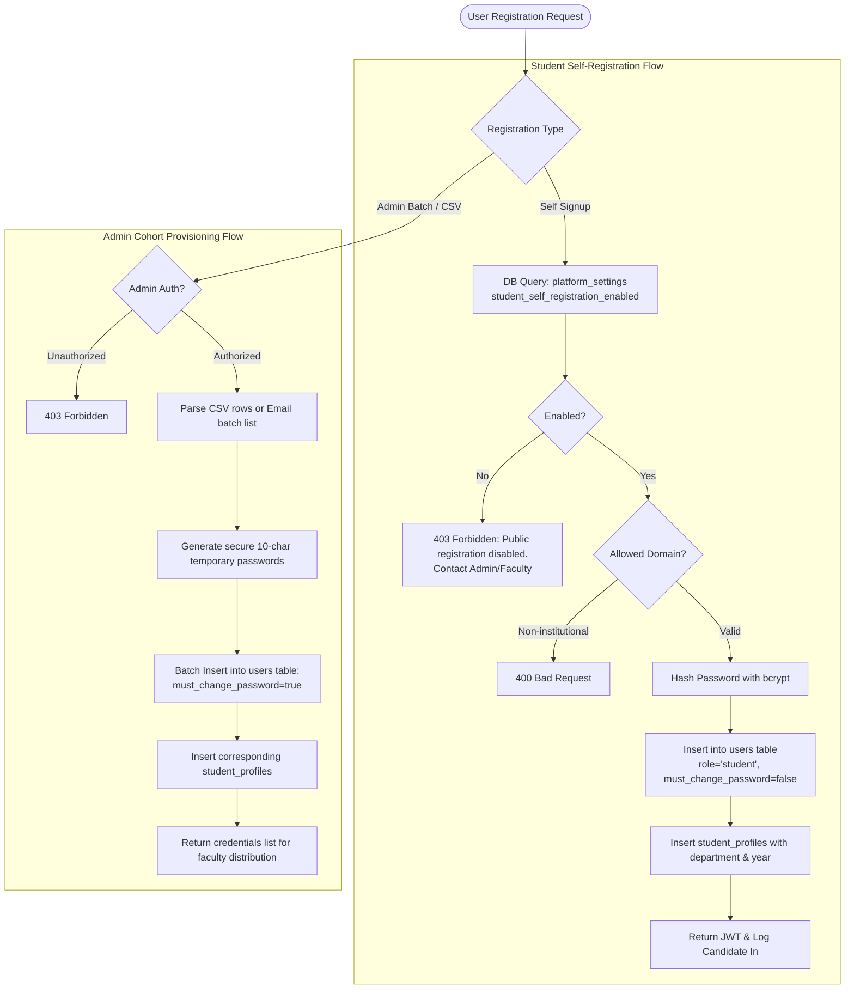
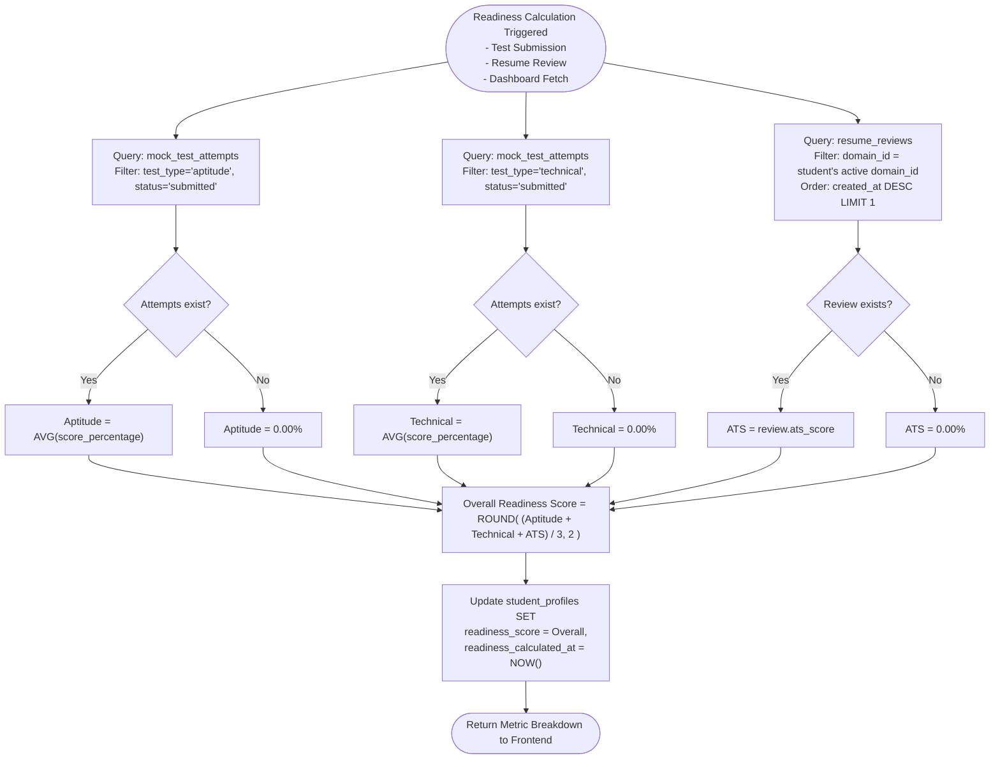
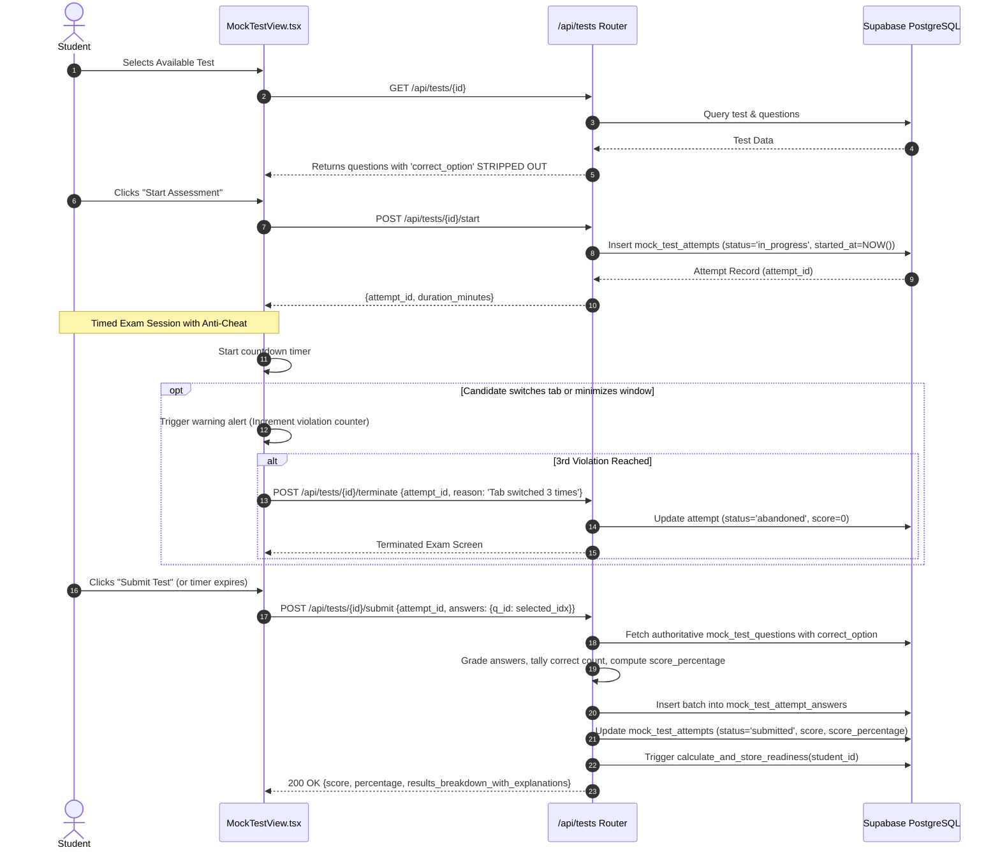
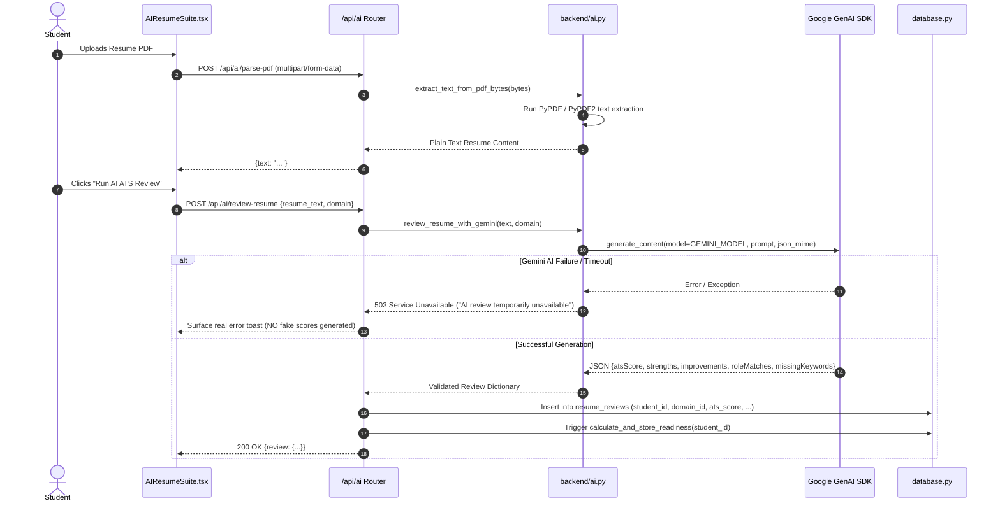
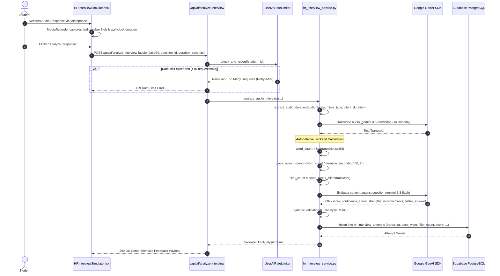
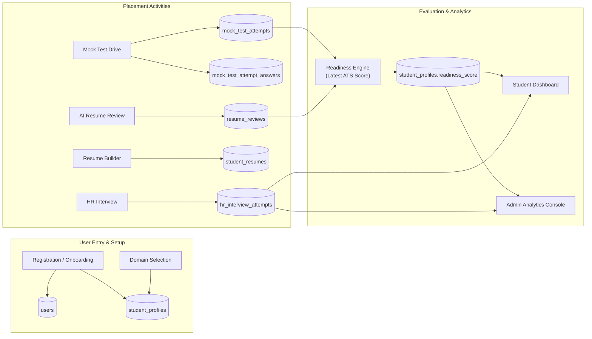

# Impulse — Technical Architecture Document
> **Target System:** Impulse — UCEK Placement & Career Readiness Suite  
> **Institution:** University College of Engineering Kariavattom (UCEK), University of Kerala  
> **Source Base:** Full Production Monorepo (`backend/` + `frontend/`)  
> **Status:** Current Working Architecture  

---

## Table of Contents
1. [Project Overview](#1-project-overview)
2. [High-Level System Architecture](#2-high-level-system-architecture)
3. [Frontend Architecture](#3-frontend-architecture)
4. [Backend Architecture](#4-backend-architecture)
5. [Database Architecture](#5-database-architecture)
6. [Authentication and Authorization Pipeline](#6-authentication-and-authorization-pipeline)
7. [Student Registration and Onboarding Pipeline](#7-student-registration-and-onboarding-pipeline)
8. [Student Dashboard Data Pipeline](#8-student-dashboard-data-pipeline)
9. [Readiness Calculation Pipeline](#9-readiness-calculation-pipeline)
10. [Mock Test Architecture](#10-mock-test-architecture)
11. [AI Resume Reviewer Pipeline](#11-ai-resume-reviewer-pipeline)
12. [JD Matcher Pipeline](#12-jd-matcher-pipeline)
13. [HR Interview Simulator Pipeline](#13-hr-interview-simulator-pipeline)
14. [AI Architecture and Guardrails](#14-ai-architecture-and-guardrails)
15. [Notification Architecture](#15-notification-architecture)
16. [Domain Roadmap Architecture](#16-domain-roadmap-architecture)
17. [Admin Architecture](#17-admin-architecture)
18. [End-to-End Data Flow Map](#18-end-to-end-data-flow-map)
19. [Error Handling Architecture](#19-error-handling-architecture)
20. [Configuration and Environment Variables](#20-configuration-and-environment-variables)
21. [Deployment and Runtime Architecture](#21-deployment-and-runtime-architecture)
22. [Security Architecture](#22-security-architecture)
23. [Diagram Index](#23-diagram-index)

---

## 1. Project Overview

### 1.1 Purpose
**Impulse** is the dedicated placement preparation, assessment, and career-readiness platform developed for students and administrators of the **University College of Engineering Kariavattom (UCEK)**. The suite provides standardized mock placement drives, automated resume analysis, AI-powered mock HR interviews with authoritative audio speech analytics, and administrative tracking of campus readiness metrics.

### 1.2 User Roles
The platform implements two active roles:
1. **Student (`student`)**: College candidates who undertake mock tests, track departmental readiness scores, build ATS-compliant resumes, receive domain-aligned feedback, and practice recorded HR interviews.
2. **Administrator (`admin`)**: Placement Officers (TPO) and faculty members who manage platform settings, provision student cohorts via CSV or bulk email lists, upload and publish mock test drives, and inspect campus-wide readiness analytics.
*(Note: A third role, `mentor`, is formally deferred in current production releases).*

### 1.3 Major Functional Modules
- **Authentication & Onboarding**: Email/password authentication, self-registration control toggle, OTP-based password resets, and admin bulk student provisioning with temporary credentials.
- **Student Dashboard**: Live readiness KPI gauge, aptitude/technical/ATS metric breakdowns, company drive target selection, and recent activity feeds.
- **Mock Test Drive Engine**: Timed assessments with departmental targeting, client-side anti-cheat monitoring (tab-blur tracking and full-screen enforcement), question palette navigation, and instant grading.
- **AI Resume Suite**: Dual-template resume builder (ATS & Modern), plain-text PDF extraction, Gemini-driven domain-specific ATS scoring, bullet point enhancer, and interactive Job Description (JD) matching.
- **HR Interview Simulator**: Real-time microphone audio capture, Gemini speech transcription, authoritative backend calculation of speech metrics (Words-Per-Minute, filler word detection), and structured evaluation.
- **Admin Management Console**: Campus KPIs, paginated student listings with multi-dimensional filtering (branch, year, readiness thresholds), mock test authoring, and platform registration settings.

### 1.4 Technology Stack Summary
| Domain | Technology / Library | Role in System |
| :--- | :--- | :--- |
| **Frontend Core** | React 18, Vite, TypeScript | SPA framework and type-safe UI logic |
| **Frontend Styling** | Tailwind CSS, Custom Vanilla CSS tokens | Theme styling, dark mode, responsive layouts |
| **Animation & Motion** | Framer Motion, Lenis Scroll, Three.js / WebGL | Smooth scrolling, page transitions, canvas visuals |
| **Icons & Media** | Lucide React, html2pdf.js | Vector icons and client-side PDF document generation |
| **Backend Core** | FastAPI (v0.136), Uvicorn (v0.46), Python 3.11+ | High-performance asynchronous REST API framework |
| **Data Validation** | Pydantic (v2.13), Pydantic Settings | Request/response schemas and environment parsing |
| **Database & Storage** | Supabase (PostgreSQL 15+), PostgREST | Authoritative relational data persistence & file storage |
| **Security & Auth** | PyJWT (HS256), bcrypt (v5.0), SlowAPI | JWT validation, password hashing, and rate limiting |
| **AI Integration** | Google GenAI SDK (`google-genai` v0.1+) | Gemini models for transcription, evaluation, and resume reviews |
| **Audio & PDF Processing**| PyPDF, PyPDF2, mutagen, wave, struct | Document text parsing and binary audio duration extraction |

### 1.5 Implementation Status Breakdown
- **CURRENTLY IMPLEMENTED**:
  - Full Student & Admin Authentication with session token storage and strict environment secrets.
  - Admin Student Onboarding (CSV upload, multi-line email batch creation, temporary password generation, forced password change flag).
  - Platform Self-Registration control toggle (persisted in database).
  - Mock Test Drive Engine (Admin CSV upload, department/year targeting, student assessment, timer, anti-cheat detection, scoring, attempt history).
  - Mock Test Notifications with 30-second polling and persistent seen-state timestamps.
  - Authoritative Placement Readiness calculation formula combining Aptitude, Technical, and ATS scores.
  - AI Resume Reviewer (domain-aligned scoring, strengths, weaknesses, role matches) with zero mock fallbacks.
  - AI Bullet Point Enhancer and JD Matcher (ephemeral alignment analysis).
  - HR Interview Simulator with Gemini audio transcription, backend WPM/filler calculation, and Pydantic-validated feedback.
  - Student Profile management (branch, year, active domain selection) and password change dialog.
- **PARTIALLY IMPLEMENTED**:
  - Domain Roadmap: Domain selection and specialization confirmation is fully functional and persisted to PostgreSQL; interactive milestone-by-milestone checklist UI is deferred.
  - Resume Builder: Interactive multi-section builder and client-side PDF export are fully operational; photo upload storage to Supabase buckets is plumbed via data models.
- **DEFERRED / PLANNED**:
  - 1-on-1 Alumni Mentorship matching and real-time chat (currently routed to an explicit "Coming Soon" card).
  - WhatsApp / SMS transactional alert dispatching.
  - Background asynchronous task workers (Redis / Celery) for non-blocking audio analysis.

---

## 2. High-Level System Architecture



### ASCII Architecture Fallback
```text
+-----------------------------------------------------------------------+
|                         CLIENT WEB BROWSERS                           |
|       Student (Dashboard/Tests/AI)    |    Admin (KPIs/Tests/Users)   |
+-----------------------------------------------------------------------+
                                  |
                                  v  HTTPS / JSON API
+-----------------------------------------------------------------------+
|                    FASTAPI APPLICATION SERVER                         |
|  - Middleware: CORS, SlowAPI Rate Limiter                             |
|  - Auth: PyJWT (Bearer token validation, role enforcement)            |
|  - Routers: /api/auth, /api/user, /api/tests, /api/ai, /api/admin     |
|  - Engine Services:                                                   |
|      * hr_interview_service.py (Audio metrics, WPM, transcript)       |
|      * ai.py (Gemini 3.5/3.8 invocation & prompt boundaries)          |
|      * database.py (Supabase DB Data Access Object)                   |
+-----------------------------------------------------------------------+
            |                                           |
            v  HTTPS (PostgREST)                        v  HTTPS (GenAI SDK)
+---------------------------+               +---------------------------+
|    SUPABASE POSTGRESQL    |               |      GOOGLE GEMINI AI     |
|  - Relational Tables      |               |  - Audio Transcription    |
|  - Foreign Key Rel.       |               |  - Structured Evaluation  |
|  - Storage Buckets        |               |  - Resume ATS Scoring     |
+---------------------------+               +---------------------------+
```

---

## 3. Frontend Architecture

### 3.1 Entry Point & Bootstrapping
- **`frontend/src/main.tsx`**: Bootstraps the React DOM root (`React.StrictMode`) and mounts `<App />`.
- **`frontend/src/App.tsx`**: Acts as the master orchestrator. Initializes:
  - **Lenis Smooth Scroll** instance with RAF loop and spring physics progress bar.
  - **Splash Screen** overlay (`SplashScreen.tsx`) triggered on initial page visit.
  - **Maintenance Mode** guard intercepting requests if `VITE_MAINTENANCE_MODE=true`.
  - **Role-Based Layout** routing between Unauthenticated (`LandingPage`), Student (`StudentNavHeader` + student views), and Admin (`AdminNavHeader` + admin views).
  - **Error Boundary** (`ErrorBoundary.tsx`) wrapping application sub-trees to prevent unhandled React crashes.

### 3.2 Navigation & Routing Architecture
Impulse uses an in-memory active-tab routing system driven by `AppContext`:
```text
activeTab state:
├── Unauthenticated:
│   └── 'landing' -> LandingPage.tsx (Includes Auth Modals)
├── Student Role:
│   ├── 'dashboard'     -> Dashboard.tsx
│   ├── 'roadmap'       -> DomainRoadmap.tsx (Domain Selection & Pathway)
│   ├── 'resume-suite'  -> AIResumeSuite.tsx (Reviewer, Builder, Matcher)
│   ├── 'tests'         -> MockTests.tsx / MockTestView.tsx (Drive Engine)
│   ├── 'interview'     -> HRInterviewSimulator.tsx (Audio Practice)
│   └── 'mentorship'    -> Mentorship.tsx (Deferred Coming-Soon View)
└── Admin Role:
    ├── 'admin-dashboard'  -> AdminPanel.tsx (KPIs & Student Table)
    ├── 'admin-tests'      -> AdminMockTests.tsx (CSV Upload & Publish)
    ├── 'admin-onboarding' -> StudentOnboardingView.tsx (Bulk Provisioning)
    └── 'admin-roles'      -> AdminPanel.tsx (Role Management Sub-view)
```

### 3.3 State Management (`AppContext.tsx`)
The central React Context (`AppContext.tsx`) manages global client state:
- **`user`**: The active user payload (`id`, `name`, `email`, `role`, `department_code`, `year`, `domain_id`, `readiness_score`, `must_change_password`).
- **`activeTab`**: The currently rendered functional view.
- **`theme`**: Dark mode theme token (defaulted to dark aesthetic).
- **`notifications`**: Published mock test notifications polled periodically.
- **`resumeData`**: Structured CV state synchronized with the backend database.
- **Session Tokens**: Access tokens are stored strictly in `sessionStorage` (`ucek_access_token`) and cleared on logout. Any legacy tokens in `localStorage` are automatically purged.

### 3.4 API & Service Layer (`frontend/src/lib/api.ts`)
All frontend HTTP communication routes through `api.ts`:
- **`authFetch` Wrapper**: Intercepts every outgoing request, appends `Authorization: Bearer <token>`, and listens for `401 Unauthorized` responses. On encountering a 401, it automatically clears credentials and broadcasts `ucek:unauthorized` to gracefully log out the user.
- **Zero-Mock Policy**: API endpoints return genuine backend responses or throw catchable errors; synthetic data illusions have been systematically eliminated.

### 3.5 Frontend Component Hierarchy

```mermaid
graph TD
    App["App.tsx"]
    App --> Splash["SplashScreen.tsx"]
    App --> EB["ErrorBoundary.tsx"]
    App --> OBG["OrangeBlackGradient.tsx"]
    
    subgraph Navigation["Navigation Bar Tier"]
        App --> LandingNav["Header.tsx (Public)"]
        App --> StudNav["StudentNavHeader.tsx"]
        App --> AdminNav["AdminNavHeader.tsx"]
    end
    
    subgraph Modals["Global Modal Tier"]
        StudNav --> EditProfile["EditProfileModal.tsx"]
    end

    subgraph Pages["View Router Tier (Lazy Loaded)"]
        App --> P_Landing["LandingPage.tsx"]
        App --> P_Dash["Dashboard.tsx"]
        App --> P_Tests["MockTests.tsx & MockTestView.tsx"]
        App --> P_Resume["AIResumeSuite.tsx"]
        App --> P_HR["HRInterviewSimulator.tsx"]
        App --> P_Roadmap["DomainRoadmap.tsx"]
        App --> P_Admin["AdminPanel.tsx"]
        App --> P_AdminTests["AdminMockTests.tsx"]
        App --> P_AdminOnboard["StudentOnboardingView.tsx"]
        App --> P_Mentor["Mentorship.tsx"]
    end
```


---

## 4. Backend Architecture

### 4.1 Application Setup (`backend/main.py`)
- **FastAPI Core**: Initialized with custom metadata and docs disabled/restricted for production hardening.
- **Environment Bootstrap**: Double-pass loading of `.env` from root and `backend/` directories.
- **CORS Middleware**: Explicitly whitelists institutional origins (`https://impulse.uck.ac.in`, `https://impulseucek.vercel.app`, `http://localhost:5173`, `http://localhost:3000`).
- **SlowAPI Rate Limiter**: Configures IP-based and user-based request throttling with a unified JSON 429 response handler.
- **Health & Monitoring Endpoints**:
  - `GET/HEAD/POST /api/health`: Uptime and version verification.
  - `GET/HEAD/POST /api/keep-alive`: Live ping verifying database PostgREST responsiveness.

### 4.2 Router Architecture
| Router File | Route Prefix | Primary Scope | Auth Level |
| :--- | :--- | :--- | :--- |
| `routers/auth.py` | `/api/auth` | Login, Register, Refresh, Logout, Password Reset OTP | Public & User |
| `routers/user.py` | `/api/user` | Profile, Domain Selection, Password Change, Resume CRUD, Dashboard | Student / User |
| `routers/tests.py` | `/api/tests` | Student Test List, Attempt Start/Submit/Terminate, History, CSV Upload | Student & Admin |
| `routers/ai_suite.py`| `/api/ai` | PDF Text Parsing, Resume Review, Bullet Enhance, JD Match, HR Interview | Student / User |
| `routers/admin.py` | `/api/admin` | Campus KPIs, Filterable Student Table, Platform Settings | Admin Only |
| `routers/onboarding_router.py` | `/api/admin/users` | CSV Bulk Provisioning, Email Batch Creation | Admin Only |
| `routers/roadmap.py`| `/api/roadmap` | Domain Roadmap Queries and Item Toggle | Student |
| `routers/mentorship.py`| `/api/mentors` | Deferred Stubs returning clean empty states | User |

### 4.3 Service & Utility Layers
```text
backend/
├── auth.py                  # JWT encode/decode, token revocation, get_current_user dependency
├── database.py              # Supabase Client, SQL abstraction, Readiness calculations, Admin seeding
├── ai.py                    # Gemini SDK client, model resolution, PDF text extractor, prompt templates
├── schemas.py               # Pydantic v2 schemas for all API payloads and DTOs
└── services/
    └── hr_interview_service.py # Audio container parsing, WPM calculation, Gemini interview analysis
```

---

## 5. Database Architecture

The PostgreSQL database (hosted via Supabase) serves as the **single source of truth** for all application state. Direct frontend access is prohibited; all mutations occur via backend PostgREST queries with authenticated credentials.

### 5.1 Core Tables & Schema Specifications

#### 1. `users`
Stores account identities, authentication credentials, and system roles.
- **`id`** (`UUID`, PK): User unique identifier.
- **`name`** (`TEXT`, NOT NULL): Full name of the student or administrator.
- **`email`** (`TEXT`, NOT NULL, UNIQUE): Normalized lowercase email address.
- **`password_hash`** (`TEXT`, NOT NULL): Salted bcrypt password hash.
- **`role`** (`TEXT`, NOT NULL): System role (`student` or `admin`).
- **`is_active`** (`BOOLEAN`, DEFAULT `true`): Account activation flag.
- **`must_change_password`** (`BOOLEAN`, DEFAULT `false`): Flags provisioned accounts that must reset credentials upon first login.
- **`created_at` / `updated_at`** (`TIMESTAMPTZ`): Record audit timestamps.

#### 2. `departments`
Academic engineering branches at UCEK.
- **`id`** (`UUID`, PK): Department unique identifier.
- **`code`** (`TEXT`, UNIQUE): Branch abbreviation (`CSE`, `IT`, `ECE`).
- **`name`** (`TEXT`, NOT NULL): Full department title.
- **`is_active`** (`BOOLEAN`, DEFAULT `true`): Department operational status.

#### 3. `student_profiles`
Extended profile for candidate tracking and metrics.
- **`id`** (`UUID`, PK): Profile identifier.
- **`user_id`** (`UUID`, FK -> `users.id`, ON DELETE CASCADE, UNIQUE): Associated candidate.
- **`department_id`** (`UUID`, FK -> `departments.id`, Nullable): Enrolled department.
- **`year`** (`SMALLINT`, Nullable): Academic year of study (`1`, `2`, `3`, `4`).
- **`domain_id`** (`UUID`, FK -> `domains.id`, Nullable): Current chosen specialization.
- **`readiness_score`** (`NUMERIC(5,2)`, DEFAULT `0.00`): Cached placement readiness score snapshot (0-100%).
- **`readiness_calculated_at`** (`TIMESTAMPTZ`): Timestamp of last readiness formula execution.
- **`last_mock_test_notifications_seen_at`** (`TIMESTAMPTZ`): Timestamp when student cleared active drive alerts.

#### 4. `domains`
Career and technical specialization pathways.
- **`id`** (`UUID`, PK): Specialization identifier.
- **`name`** (`TEXT`, UNIQUE): Domain title (e.g., "Software Engineering", "Cybersecurity").
- **`slug`** (`TEXT`, UNIQUE): URL-safe identifier (e.g., `software-engineering`).
- **`is_active`** (`BOOLEAN`, DEFAULT `true`): Catalog visibility.

#### 5. `mock_tests`
Assessment metadata and targeting parameters.
- **`id`** (`UUID`, PK): Mock test unique identifier.
- **`title`** (`TEXT`, NOT NULL): Assessment title (e.g., "TCS National Qualifier Test 2026").
- **`test_type`** (`TEXT`, NOT NULL): Category (`aptitude`, `technical`, `general`).
- **`duration_minutes`** (`INT`, NOT NULL): Time limit.
- **`target_department_id`** (`UUID`, FK -> `departments.id`, Nullable): If null, targets all branches.
- **`target_year`** (`SMALLINT`, Nullable): If null, targets all academic years.
- **`is_published`** (`BOOLEAN`, DEFAULT `false`): Visibility to candidates.
- **`published_at`** (`TIMESTAMPTZ`): Timestamp of publication.

#### 6. `mock_test_questions`
Questions linked to specific assessments.
- **`id`** (`UUID`, PK): Question identifier.
- **`test_id`** (`UUID`, FK -> `mock_tests.id`, ON DELETE CASCADE): Parent test.
- **`question_text`** (`TEXT`, NOT NULL): The question prompt.
- **`options`** (`JSONB`, NOT NULL): Array of string options `[A, B, C, D]`.
- **`correct_option`** (`SMALLINT`, NOT NULL): Zero-based integer index of correct answer.
- **`explanation`** (`TEXT`): Post-submission rationale.

#### 7. `mock_test_attempts`
Student test session execution and scoring records.
- **`id`** (`UUID`, PK): Attempt session identifier.
- **`test_id`** (`UUID`, FK -> `mock_tests.id`, ON DELETE CASCADE): Test undertaken.
- **`student_id`** (`UUID`, FK -> `users.id`, ON DELETE CASCADE): Attempting candidate.
- **`score`** (`INT`): Total correctly answered questions.
- **`total_questions`** (`INT`): Total question count in assessment.
- **`score_percentage`** (`NUMERIC(5,2)`): Computed score percentage.
- **`status`** (`TEXT`): Session state (`in_progress`, `submitted`, `abandoned`).
- **`started_at` / `submitted_at`** (`TIMESTAMPTZ`): Attempt timings.

#### 8. `mock_test_attempt_answers`
Granular question-level audit trail for every attempt.
- **`id`** (`UUID`, PK): Record identifier.
- **`attempt_id`** (`UUID`, FK -> `mock_test_attempts.id`, ON DELETE CASCADE).
- **`question_id`** (`UUID`, FK -> `mock_test_questions.id`, ON DELETE CASCADE).
- **`selected_option`** (`SMALLINT`, Nullable): Option chosen by candidate.
- **`is_correct`** (`BOOLEAN`, NOT NULL): Grading result.

#### 9. `student_resumes` & Sub-Sections
Structured CV persistence adhering to relational normalization:
- **`student_resumes`**: Parent CV record with summary, target role, template type (`ats` vs `modern`), and storage paths.
- **`student_resume_skills`**: Skills categorized into technical stacks.
- **`student_resume_projects`**: Project titles, tech stacks, links, and bullet points.
- **`student_resume_experience`**: Work experiences with date ranges and achievements.
- **`student_resume_education`**: Academic credentials, institutions, and GPA.
- **`student_resume_certifications`**: Professional credentials.

#### 10. `resume_reviews`
Historical record of AI ATS evaluations.
- **`id`** (`UUID`, PK): Review identifier.
- **`student_id`** (`UUID`, FK -> `users.id`, ON DELETE CASCADE): Evaluated candidate.
- **`domain_id`** (`UUID`, FK -> `domains.id`, Nullable): Target domain evaluated against.
- **`ats_score`** (`NUMERIC(5,2)`, NOT NULL): Quantitative ATS rating (0-100).
- **`strengths` / `improvements`** (`JSONB`): Extracted structured lists.
- **`role_matches` / `missing_keywords`** (`JSONB`): Alignment insights.

#### 11. `hr_interview_attempts`
Quantitative results of audio mock interviews.
- **`id`** (`UUID`, PK): Attempt record.
- **`student_id`** (`UUID`, FK -> `users.id`, ON DELETE CASCADE): Candidate.
- **`question_id`** (`TEXT`, NOT NULL): Question key.
- **`question_text`** (`TEXT`, NOT NULL): Prompt text.
- **`transcript`** (`TEXT`, NOT NULL): Complete transcribed audio transcript.
- **`duration_seconds`** (`NUMERIC(6,2)`): Validated audio length.
- **`word_count`** (`INT`): Spoken word tally.
- **`pace_wpm`** (`NUMERIC(5,2)`): Authoritatively computed Words-Per-Minute.
- **`filler_count`** (`INT`): Count of detected filler words (`um`, `uh`, `like`, etc.).
- **`score`** (`NUMERIC(5,2)`): Overall answer quality rating (0-100).
- **`confidence_score`** (`NUMERIC(5,2)`): Articulation confidence score.
- **`strengths` / `improvements` / `better_answer`** (`JSONB`): Structured exemplar guidance.

#### 12. `platform_settings`
Global operational switches.
- **`key`** (`TEXT`, PK): Setting key (e.g. `student_self_registration_enabled`).
- **`value`** (`TEXT`): Serialized configuration value (`true`/`false`).

### 5.2 Entity-Relationship Diagram (ERD)


---

## 6. Authentication and Authorization Pipeline

Authentication in Impulse relies on stateless JSON Web Tokens (JWT) signed with HS256, alongside httpOnly session refresh cookies.



### 6.1 Role Enforcement
- **Admin Endpoints**: Guarded by `_require_admin(current_user)` checks that verify `current_user["role"] == "admin"`. Unauthorized requests are rejected with `403 Forbidden`.
- **Student Endpoints**: Certain actions (saving a resume, undertaking an interview, submitting a test) restrict access to `role == "student"`.

---

## 7. Student Registration and Onboarding Pipeline



---

## 8. Student Dashboard Data Pipeline

The Student Dashboard aggregates data from multiple specialized endpoints upon load:

| Dashboard Card / Component | Source API Endpoint | Backend Resolution Logic | Computed vs Stored |
| :--- | :--- | :--- | :--- |
| **Placement Readiness Gauge** | `GET /api/user/readiness` | `get_user_readiness_metrics(uid)` | **Computed dynamically** from 3 components; snapshot persisted in `student_profiles`. |
| **Aptitude Metric Card** | `GET /api/user/readiness` | Average `score_percentage` of all submitted aptitude mock test attempts. | **Computed dynamically** on-demand. |
| **Technical Metric Card** | `GET /api/user/readiness` | Average `score_percentage` of all submitted technical mock test attempts. | **Computed dynamically** on-demand. |
| **Resume ATS Metric Card** | `GET /api/user/readiness` | Most recent `ats_score` in `resume_reviews` for student's active domain. | **Stored** from previous AI review. |
| **Mock Drive Summary** | `GET /api/tests/practice-summary` | Aggregates total targeted published tests vs cleared test attempts. | **Computed dynamically**. |
| **Recent Test History Table** | `GET /api/tests/history/my` | Fetches last 5 submissions from `mock_test_attempts`. | **Stored records**. |
| **Latest HR Audio Score** | `GET /api/ai/speech-analytics` | Reads latest entry from `hr_interview_attempts`. | **Stored records** (returns 0s if never attempted). |
| **Active Domain Badge** | `GET /api/user/profile` | Joins `student_profiles.domain_id` to `domains.name`. | **Stored record**. |

---

## 9. Readiness Calculation Pipeline



---

## 10. Mock Test Architecture

### 10.1 Authoring & Publication (Admin)
Admins upload question banks via CSV files containing 7 strict columns:
`Question, Option A, Option B, Option C, Option D, Correct Option, Explanation`.
1. **Validation**: The backend verifies non-empty question stems, validates correct option indices (1-4 or A-D converted to 0-3), and checks positive durations.
2. **Storage**: The test record is inserted into `mock_tests` with `is_published=false` alongside child records in `mock_test_questions`.
3. **Publication**: Toggling publish updates `is_published=true` and sets `published_at=NOW()`.

### 10.2 Assessment Session Lifecycle (Student)


---

## 11. AI Resume Reviewer Pipeline



---

## 12. JD Matcher Pipeline

The Job Description Matcher is an **ephemeral analytical service**. Results are returned directly to the candidate for real-time gap analysis and are **never stored** in the database:
1. **Input**: Candidate provides resume text and target Job Description text.
2. **Analysis Flow**:
   - Backend extracts technical tokens and keyword overlaps.
   - Prompt sent to Gemini instructs the model to evaluate semantic alignment, missing core qualifications, and actionable keywords.
3. **Output**: Returns JSON containing `matchScore` (percentage), `alignmentSummary` (narrative), `matchingSkills` (list), and `missingCriticalSkills` (list).
4. **Resilience**: If the external AI service fails, an HTTP 500 error is returned; no synthetic matching percentages are fabricated.

---

## 13. HR Interview Simulator Pipeline

The HR Interview Simulator pairs client-side media capture with authoritative backend speech processing:



---

## 14. AI Architecture and Guardrails

### 14.1 Central Model Configuration
AI model selection is centrally resolved in `backend/ai.py` and `backend/services/hr_interview_service.py`:
- **Configuration Hierarchy**:
  `os.getenv("GEMINI_MODEL")` -> `os.getenv("GEMINI_HR_EVALUATION_MODEL")` -> `os.getenv("HR_EVALUATION_MODEL")` -> Default `gemini-3.5-flash-lite` or `gemini-3.8-flash`.
- Updating the environment variable automatically adjusts model routing across Resume Reviewer, JD Matcher, Bullet Enhancer, and Interview Evaluation without code modifications.

### 14.2 Anti-Hallucination Architectural Guardrails
To prevent AI hallucination and ensure scoring integrity:
1. **Mathematical Authority**:
   - **Speech Pace (WPM)** is calculated using deterministic arithmetic: $\text{WPM} = \frac{\text{Word Count}}{\text{Duration in Minutes}}$. The AI is never asked to guess talking speed.
   - **Filler Word Detection**: Computed using authoritative regular expressions against standard speech disfluencies (`\bum\b`, `\buh\b`, `\ber\b`, `\bah\b`, `\blike\b`).
   - **Placement Readiness**: Evaluated by Python database logic using historical SQL records.
2. **Strict Schema Parsing**: Every AI response is enforced through Pydantic schemas using structured JSON output modes (`response_mime_type="application/json"`).
3. **No Fabricated Fallbacks**: When Gemini encounters rate limits or upstream errors, the API raises clean HTTP 500/503 errors. The platform never returns mock feedback when real AI inference fails.

---

## 15. Notification Architecture

```mermaid
flowchart LR
    AdminPublish([Admin Publishes Mock Test]) --> SaveTest[Insert/Update mock_tests<br/>is_published=true, published_at=NOW()]
    
    subgraph PollingEngine["Frontend Polling Engine (Current Session)"]
        StudentClient[Student Dashboard] -->|Polls every 30s| FetchAlerts[GET /api/tests/notifications]
    end

    SaveTest -.-> FetchAlerts
    FetchAlerts --> FilterTarget{Matches Department & Year?}
    FilterTarget -->|No| Discard[Ignored]
    FilterTarget -->|Yes| FilterSeen{published_at > last_seen_at?}
    FilterSeen -->|No| Discard
    FilterSeen -->|Yes| ShowToast[Display Header Alert Badge & Toast]

    StudentClient -->|Clicks Notification Bell| MarkSeen[POST /api/tests/notifications/seen]
    MarkSeen --> UpdateDB[Update student_profiles SET<br/>last_mock_test_notifications_seen_at = NOW()]
```

---

## 16. Domain Roadmap Architecture

### 16.1 Current Implementation
- **Catalog Source**: The platform maintains 9 approved engineering specializations:
  1. Software Engineering
  2. Backend Engineering
  3. Data Science & Data Analytics
  4. Artificial Intelligence & Machine Learning
  5. Cybersecurity
  6. UI/UX & Product Design
  7. Graphic Design
  8. Video Editing
  9. Core Electronics & Embedded Systems
- **Domain Selection**: Candidates confirm or switch their specialization via `POST /api/user/select-domain`. The choice is persisted to `student_profiles.domain_id`.
- **Domain Switch Rule**: Switching specializations automatically resets previous roadmap progress in `student_roadmap_progress` to prevent cross-domain contamination.

### 16.2 Deferred Roadmap Features
- Interactive, multi-tier curriculum milestone trees and step-by-step learning modules are deferred to future roadmap releases. The database tables (`roadmap_items`, `student_roadmap_progress`) exist to support this transition.

---

## 17. Admin Architecture

```mermaid
flowchart TD
    AdminUser([Administrator / Placement Officer]) --> AdminNav[AdminNavHeader]

    AdminNav --> Tab1[Admin Dashboard<br/>AdminPanel.tsx]
    AdminNav --> Tab2[Mock Test Management<br/>AdminMockTests.tsx]
    AdminNav --> Tab3[Student Onboarding<br/>StudentOnboardingView.tsx]

    subgraph Tab1Ops["Dashboard Operations"]
        Tab1 --> FetchKPIs[GET /api/admin/dashboard-stats]
        Tab1 --> FilterStudents[GET /api/admin/students<br/>Filter by Dept, Year, Domain, Readiness]
        Tab1 --> StudentDetail[GET /api/admin/students/{id}<br/>Inspect CV, Test History, Audio Scores]
    end

    subgraph Tab2Ops["Test Management Operations"]
        Tab2 --> UploadCSV[POST /api/tests/upload-csv<br/>Upload 7-column CSV]
        Tab2 --> PublishTest[POST /api/tests/{id}/publish<br/>Target Dept/Year]
        Tab2 --> DeleteTest[DELETE /api/tests/{id}]
    end

    subgraph Tab3Ops["Onboarding Operations"]
        Tab3 --> ToggleSelfReg[PUT /api/admin/platform-settings/registration]
        Tab3 --> BatchEmail[POST /api/admin/users/batch-create]
        Tab3 --> BatchCSV[POST /api/admin/users/batch-create-csv]
    end
```

---

## 18. End-to-End Data Flow Map



---

## 19. Error Handling Architecture

- **Frontend Error Boundary (`ErrorBoundary.tsx`)**: Catches unexpected React lifecycle render exceptions, preventing white-screen crashes and presenting a recovery button.
- **Unified 401 Interception**: Intercepts unauthenticated API responses via `authFetch`, clears session tokens, and gracefully returns the candidate to the login modal.
- **Backend Exception Hierarchy**:
  - `HTTPException(400)`: Bad request, schema mismatch, or unselectable PDF text.
  - `HTTPException(401)`: Missing, expired, or invalid JWT credentials.
  - `HTTPException(403)`: Insufficient role permissions or self-registration disabled.
  - `HTTPException(404)`: Missing resource.
  - `HTTPException(429)`: SlowAPI / Gemini user rate limit exceeded.
  - `HTTPException(500/503)`: Upstream database or Gemini AI service errors.
- **Rate Limit Handlers**: Emits standard JSON responses detailing wait intervals.

---

## 20. Configuration and Environment Variables

All operational settings are managed via environment variables. Sensitive secrets are strictly loaded at runtime:

| Category | Variable Name | Purpose / Function | Sensitivity |
| :--- | :--- | :--- | :--- |
| **Database** | `SUPABASE_URL` | HTTPS PostgREST endpoint for Supabase PostgreSQL. | Public / Config |
| **Database** | `SUPABASE_KEY` / `SUPABASE_SERVICE_ROLE_KEY` | Service role or anon secret key for Supabase access. | **Critical Secret** |
| **Authentication** | `JWT_SECRET` | 256-bit cryptographic secret for signing HS256 tokens. | **Critical Secret** |
| **Authentication** | `ADMIN_DEFAULT_PASSWORD` | Initial password applied when seeding default admin. | **Critical Secret** |
| **Authentication** | `ADMIN_SECRET_KEY` | Passcode required for self-registering an admin account. | **Critical Secret** |
| **Authentication** | `ACCESS_TOKEN_EXPIRE_MINUTES` | Access token duration (default: `60`). | Standard Config |
| **AI Integration** | `GEMINI_API_KEY` | Google AI Studio authentication key for Gemini SDK. | **Critical Secret** |
| **AI Integration** | `GEMINI_MODEL` | Master model identifier (default: `gemini-3.5-flash-lite`). | Standard Config |
| **AI Integration** | `HR_EVALUATION_MODEL` | Specialized interview evaluation model. | Standard Config |
| **Rate Limiting** | `AI_REQUESTS_PER_MINUTE` | Per-user rate ceiling for audio AI analysis (default: `10`).| Standard Config |
| **Application** | `FASTAPI_PORT` | HTTP port for Uvicorn server (default: `8000`). | Standard Config |
| **Application** | `ENVIRONMENT` | Environment toggle (`development` vs `production`). | Standard Config |
| **Frontend** | `VITE_API_BASE_URL` | Root URL pointing React client to FastAPI backend. | Public / Config |
| **Frontend** | `VITE_MAINTENANCE_MODE` | Emergency switch toggling `<Maintenance />` view. | Public / Config |

---

## 21. Deployment and Runtime Architecture

### 21.1 Execution Environments
- **Frontend SPA**: Built with Vite (`npm run build`), producing static HTML/JS/CSS assets deployable to Vercel, Netlify, or AWS S3/CloudFront.
- **Backend API**: Packaged as a standard Python ASGI process running Uvicorn (`uvicorn backend.main:app --host 0.0.0.0 --port 8000`) deployed to Render or a Linux container.
- **Database**: Cloud-hosted Supabase managed PostgreSQL 15+ instance.

### 21.2 Production Assumptions
- HTTPS termination occurs at the edge CDN (Vercel) and application ingress (Render).
- Audio and PDF processing execute in memory; temporary files are avoided.
- The platform operates as a stateless backend service with all state offloaded to Supabase PostgreSQL.

---

## 22. Security Architecture

### 22.1 Authentication & Token Safety
- **No Insecure Secret Fallbacks**: Both `JWT_SECRET` and `ADMIN_DEFAULT_PASSWORD` must be provided via `.env`. Hardcoded fallback secrets have been completely removed.
- **Session-Scoped Tokens**: Access tokens reside in `sessionStorage` rather than `localStorage`, preventing tokens from persisting across browser closures and mitigating persistent XSS attack windows.

### 22.2 Data Access & SQL Injection Immunity
- All database operations utilize Supabase PostgREST parameter-binding. Raw SQL string concatenation is completely absent across the application.
- All mutating endpoints identify candidates directly from verified JWT token payloads (`current_user["id"]`), eliminating Insecure Direct Object Reference (IDOR) tampering.

### 22.3 Rate Limiting & Denial of Service Protection
- Public authentication routes (`/api/auth/login`, `/api/auth/register`) are throttled via SlowAPI (30 requests/minute).
- Heavy audio processing endpoints are protected by `UserAIRateLimiter` (10 requests/minute per authenticated user), preventing external quota exhaustion.

---

## 23. Diagram Index

1. **High-Level System Architecture Diagram** ([Section 2](#2-high-level-system-architecture)): Mermaid flowchart showing Browser -> Frontend -> FastAPI -> Supabase -> Gemini AI relationships.
2. **High-Level ASCII Fallback Architecture** ([Section 2](#2-high-level-system-architecture)): Text-based representation of major tiers.
3. **Frontend Component Hierarchy** ([Section 3.5](#35-frontend-component-hierarchy)): Tree diagram illustrating React layouts, navbars, and views.
4. **Database Entity-Relationship Diagram (ERD)** ([Section 5.2](#52-entity-relationship-diagram-erd)): Structural Crow's Foot diagram depicting relational tables, foreign keys, and fields.
5. **Authentication & Authorization Sequence Diagram** ([Section 6](#6-authentication-and-authorization-pipeline)): Step-by-step verification of credentials and Bearer token delegation.
6. **Registration & Onboarding Flowchart** ([Section 7](#7-student-registration-and-onboarding-pipeline)): Decision tree showing self-registration toggle vs admin batch creation.
7. **Readiness Calculation Flowchart** ([Section 9](#9-readiness-calculation-pipeline)): Formula execution diagram showing Aptitude, Technical, and ATS weighting.
8. **Mock Test Assessment Sequence Diagram** ([Section 10.2](#102-assessment-session-lifecycle-student)): Examination lifecycle, anti-cheat termination, and submission flow.
9. **AI Resume Reviewer Sequence Diagram** ([Section 11](#11-ai-resume-reviewer-pipeline)): PDF text extraction, Gemini prompt invocation, and score persistence.
10. **HR Interview Simulator Pipeline Diagram** ([Section 13](#13-hr-interview-simulator-pipeline)): Audio capture, backend WPM math, filler counting, and feedback evaluation.
11. **Mock Test Notification Flowchart** ([Section 15](#15-notification-architecture)): Publication targeting, 30s frontend polling, and persistent seen-state updating.
12. **Admin Operations Hierarchy** ([Section 17](#17-admin-architecture)): Functional breakdown of Admin Dashboard, Mock Tests, and Student Onboarding.
13. **End-to-End Data Flow Map** ([Section 18](#18-end-to-end-data-flow-map)): Application-wide lifecycle mapping user inputs to analytical outputs.
